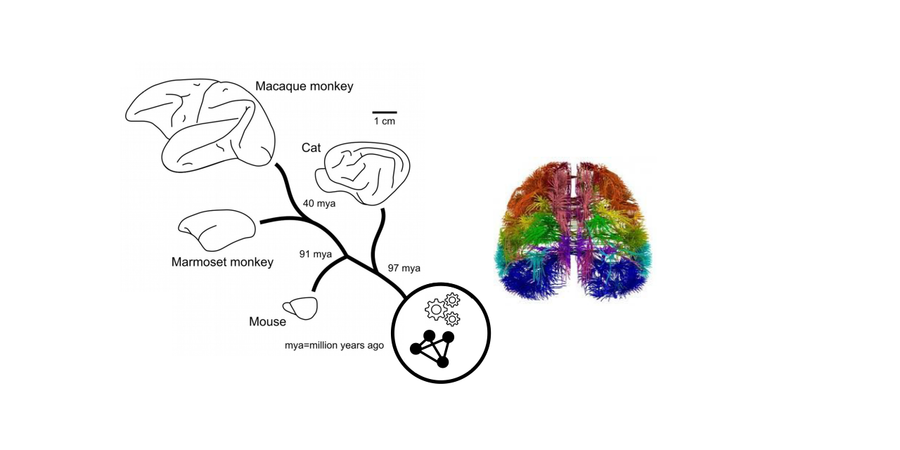

# Cross-species, cross-scales connectomics
Perform cross-species and cross-scales analysis of mammalian brain connectomes

# Description
The repository hosts the functions for the analysis (network metrics, statistics) (aux), the data (brain connectomes, cytological data for braina areas, spatial distances between areas and certain meta-data, e.g., species name) (data) and the main function to perform the analysis (main).

The main function performs the analysis as described in:

Goulas A, Majka P, Rosa MGP, Hilgetag CC (2019) A blueprint of mammalian cortical connectomes. PLoS Biol 17(3): e2005346. https://doi.org/10.1371/journal.pbio.2005346

The main function makes use of the Brain Connectivity Toolbox to compute node-wise network metrics.
https://sites.google.com/site/bctnet/

Add the folder with all the subfolders to your MATLAB path. Load the data in you workspace and run the main function (CrossSpecies_NetworkMetrics.m).

# Example

For examining all 7 species/datasets, run the following command:

species_index=[1:7];
[Stats, Plotting]=CrossSpecies_NetworkMetrics(Species, species_index, 1, 100, 'core-periphery', 'ks');

If only dataset e.g., 3 and 5 needs o be analyzed run:

[Stats, Plotting]=CrossSpecies_NetworkMetrics(Species, [3 5], 1, 100, 'core-periphery', 'ks');

See description of CrossSpecies_NetworkMetrics.m for a complete description of the inputs and the outputs.

# Citations

The following papers should be cited if any functions or data are used:

@article{10.1371/journal.pbio.2005346,
    author = {Goulas, Alexandros AND Majka, Piotr AND Rosa, Marcello G. P. AND Hilgetag, Claus C.},
    journal = {PLOS Biology},
    publisher = {Public Library of Science},
    title = {A blueprint of mammalian cortical connectomes},
    year = {2019},
    month = {03},
    volume = {17},
    url = {https://doi.org/10.1371/journal.pbio.2005346},
    pages = {1-30},
    number = {3},
    doi = {10.1371/journal.pbio.2005346}
}

@article {Scannell1995,
	author = {Scannell, JW and Blakemore, C and Young, MP},
	title = {Analysis of connectivity in the cat cerebral cortex},
	volume = {15},
	number = {2},
	pages = {1463--1483},
	year = {1995},
	doi = {10.1523/JNEUROSCI.15-02-01463.1995},
	publisher = {Society for Neuroscience},
	issn = {0270-6474},
	URL = {http://www.jneurosci.org/content/15/2/1463},
	eprint = {http://www.jneurosci.org/content/15/2/1463.full.pdf},
	journal = {Journal of Neuroscience}
}

@article{Markov2014,
author = {Markov, N. T. and Ercsey-Ravasz, M. M. and Ribeiro Gomes, A. R. and Lamy, C. and Magrou, L. and Vezoli, J. and Misery, P. and Falchier, A. and Quilodran, R. and Gariel, M. A. and Sallet, J. and Gamanut, R. and Huissoud, C. and Clavagnier, S. and Giroud, P. and Sappey-Marinier, D. and Barone, P. and Dehay, C. and Toroczkai, Z. and Knoblauch, K. and Van Essen, D. C. and Kennedy, H.},
title = {A Weighted and Directed Interareal Connectivity Matrix for Macaque Cerebral Cortex},
journal = {Cerebral Cortex},
volume = {24},
number = {1},
pages = {17-36},
year = {2014},
doi = {10.1093/cercor/bhs270},
URL = {http://dx.doi.org/10.1093/cercor/bhs270},
eprint = {/oup/backfile/content_public/journal/cercor/24/1/10.1093_cercor_bhs270/1/bhs270.pdf}
}

@Article{Zingg2014,
author={Zingg, Brian
and Hintiryan, Houri
and Gou, Lin
and Song, Monica?Y
and Bay, Maxwell
and Bienkowski, Michael?S
and Foster, Nicholas?N
and Yamashita, Seita
and Bowman, Ian
and Toga, Arthur?W
and Dong, Hong-Wei},
title={Neural Networks of the Mouse Neocortex},
journal={Cell},
year={2014},
month={Feb},
day={27},
publisher={Elsevier},
volume={156},
number={5},
pages={1096-1111},
issn={0092-8674},
doi={10.1016/j.cell.2014.02.023},
url={https://doi.org/10.1016/j.cell.2014.02.023}
}

@Article{Oh2014,
author={Oh, Seung Wook
and Harris, Julie A.
and Ng, Lydia
and Winslow, Brent
and Cain, Nicholas
and Mihalas, Stefan
and Wang, Quanxin
and Lau, Chris
and Kuan, Leonard
and Henry, Alex M.
and Mortrud, Marty T.
and Ouellette, Benjamin
and Nguyen, Thuc Nghi
and Sorensen, Staci A.
and Slaughterbeck, Clifford R.
and Wakeman, Wayne
and Li, Yang
and Feng, David
and Ho, Anh
and Nicholas, Eric
and Hirokawa, Karla E.
and Bohn, Phillip
and Joines, Kevin M.
and Peng, Hanchuan
and Hawrylycz, Michael J.
and Phillips, John W.
and Hohmann, John G.
and Wohnoutka, Paul
and Gerfen, Charles R.
and Koch, Christof
and Bernard, Amy
and Dang, Chinh
and Jones, Allan R.
and Zeng, Hongkui},
title={A mesoscale connectome of the mouse brain},
journal={Nature},
year={2014},
month={Apr},
day={02},
publisher={Nature Publishing Group, a division of Macmillan Publishers Limited. All Rights Reserved. SN  -},
volume={508},
pages={207-214},
url={http://dx.doi.org/10.1038/nature13186}
}

@article{Atapour2018,
    author = {Atapour, Nafiseh and Majka, Piotr and Wolkowicz, Ianina H and Malamanova, Daria and Worthy, Katrina H and Rosa, Marcello G P},
    title = "{Neuronal Distribution Across the Cerebral Cortex of the Marmoset Monkey (Callithrix jacchus)}",
    year = {2018},
    month = {10},
    journal = {Cerebral Cortex},
    doi = {10.1093/cercor/bhy263},
    url = {https://dx.doi.org/10.1093/cercor/bhy263},
    eprint = {http://oup.prod.sis.lan/cercor/advance-article-pdf/doi/10.1093/cercor/bhy263/26152739/bhy263.pdf},
}

@Article{Goulas2017,
author="Goulas, Alexandros
and Uylings, Harry B. M.
and Hilgetag, Claus C.",
title="Principles of ipsilateral and contralateral cortico-cortical connectivity in the mouse",
journal="Brain Structure and Function",
year="2017",
month="Apr",
day="01",
volume="222",
number="3",
pages="1281--1295",
issn="1863-2661",
doi="10.1007/s00429-016-1277-y",
url="https://doi.org/10.1007/s00429-016-1277-y"
}

@article{Majka2016,
author = {Majka, Piotr and Chaplin, Tristan A. and Yu, Hsin-Hao and Tolpygo, Alexander and Mitra, Partha P. and Wójcik, Daniel K. and Rosa, Marcello G.P.},
title = {Towards a comprehensive atlas of cortical connections in a primate brain: Mapping tracer injection studies of the common marmoset into a reference digital template},
journal = {Journal of Comparative Neurology},
year = {2016},
volume = {524},
number = {11},
pages = {2161-2181},
keywords = {digital atlas, marmoset, cerebral cortex, neuroanatomical tracing, image registration, Nissl staining, brain template},
doi = {10.1002/cne.24023},
url = {https://onlinelibrary.wiley.com/doi/abs/10.1002/cne.24023},
eprint = {https://onlinelibrary.wiley.com/doi/pdf/10.1002/cne.24023},
}

@Article{Beul2017,
author={Beul, Sarah F.
and Barbas, Helen
and Hilgetag, Claus C.},
title={A Predictive Structural Model of the Primate Connectome},
journal={Scientific Reports},
year={2017},
month={Mar},
day={03},
volume={7},
pages={43176},
note={Article},
url={http://dx.doi.org/10.1038/srep43176}
} 

